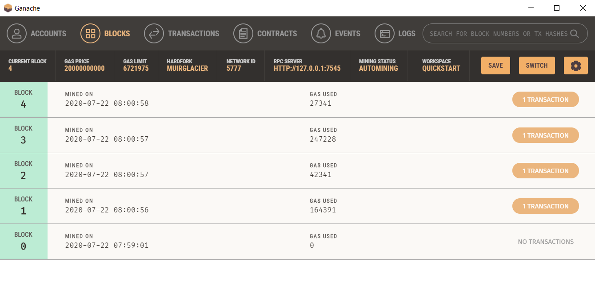

# Hello Blockchain
*Simple Blockchain Implementation to Print Hello Blockchain Using Truffle & Ganache*

### Smart Contract
```
// SPDX-License-Identifier: MIT

pragma solidity ^0.6.11;

contract Hello{

  string greeting;

  constructor() public{
    greeting = "Hello Blockchain";
  }

  function getGreeting() public view returns(string memory){
    return greeting;
  }

  function setGreeting(string memory _greeting) public{
    greeting = _greeting;
  }
}
```

### Ganache Screeshots

*Post deploying the Smart Contract*


*Post calling Smart Contract Functions*

